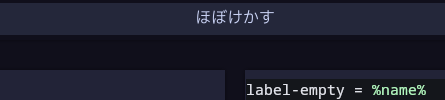
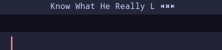

# polybar-mpris-watcher-rs

A good music status display for polybar.

It uses DBus to display the currently playing media. The text size and scrolling rate are configurable.

It supports extended unicode characters, parsing them by grapheme cluster.

Pass `--(i)nclude-controls` to include basic control buttons. This will shorten the display window such
that the overall width is `--(b)anner-size`.

# Demo





# Installation

`polybar-mpris-watcher-rs` is available on crates.io, and can be installed via `cargo`:

```
$ cargo install polybar-mpris-watcher-rs
```

You will need to add a polybar module which uses the installed binary. This is where configuration is done.

```
[module/music]
type = custom/script
exec = "polybar-mpris-watcher-rs -u 2000 -b 25"
tail = true
```

Add the module wherever in your polybar, e.g. in the middle:

```
modules-center = music
```

## Dependencies

`playerctl` is required for media controls to work.

# Font debugging

If you have trouble with some characters not displaying, give the polybar wiki [page on fonts](https://github.com/polybar/polybar/wiki/Fonts) a read.


